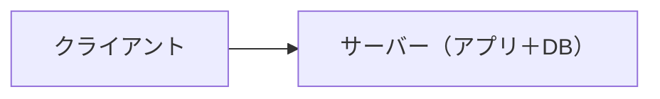
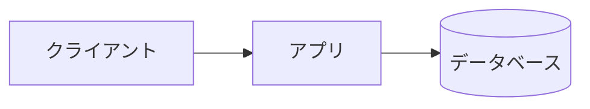
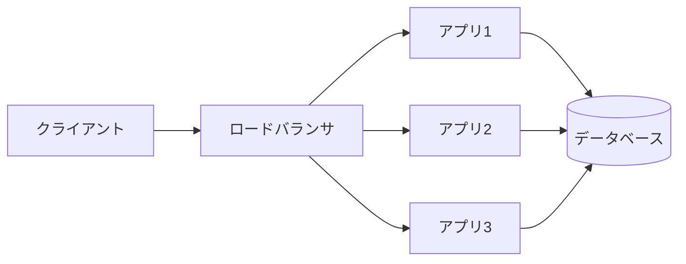
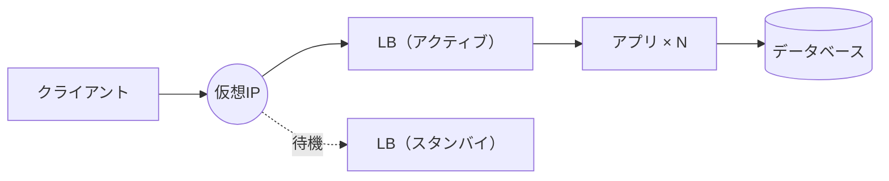
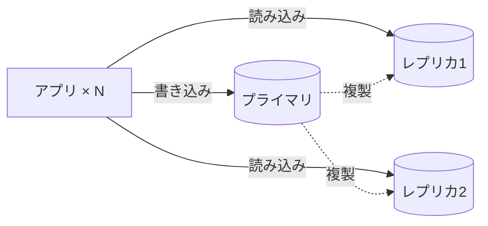
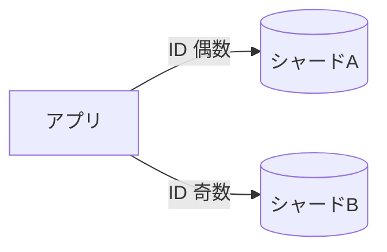
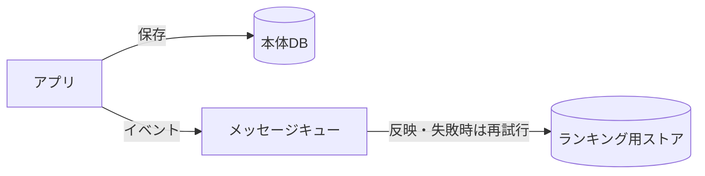
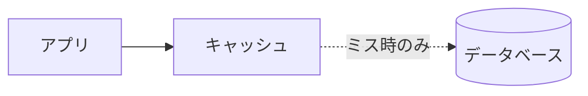

## はじめに

Webサービスの動きが重いとき、原因を探る場所は大きく5つの層に分かれます。**構成／言語の実行環境／コードのパフォーマンス／データベースのデータ構造／クエリのチューニング**です。同じ「遅い」でも、サーバーの並べ方の問題なのか、クエリの書き方の問題なのかで、打つ手はまったく違います。

この記事が扱うのは、そのうち一番上の**構成**——サーバーやデータベースをどう並べるか——だけです。残り4層（実行環境・コード・データ構造・クエリ）は、それぞれ別の記事に譲ります。

構成のスケールには、便利な性質があります。**歴史的に、ほぼ決まった順番で進化してきた**ことです。1台に全部同居させた素朴な形から始まり、負荷が増えるたびに、次に効く手がだいたい決まっている。その順番を辿ると、**「自分のサービスは今この地図のどこにいるか」**を置けるようになります。現在地が分かれば、次に来るボトルネックも見える。この地図を手に入れるのが、この記事の目的です。

もう一つ、芯になるテーマがあります。各段階の選択——垂直か水平か、分けるか統合か、強整合か遅延を許すか——には、**一意の正解がありません**。正解が毎回決まるものなら、とっくにAIが学習して答えを出しています。決まらないからこそ、状況を読み、トレードオフに折り合いをつけ、根拠を持って選び、結果に責任を持つ——この**意思決定**が、人間に残された仕事です。地図は、その判断の土台になります。

では、一番素朴なところから始めます。

---

## 1. 出発点：アプリとDBが1台に同居

最初のWebサービスは、たいてい1台のサーバーにアプリケーションもデータベースも同居した形です。クライアントがリクエストを送ると、そのサーバーがアプリを実行し、同じマシンの中のデータベースを読み書きして、レスポンスを返します。

一日に数千〜数万アクセス程度なら、これで十分回ります。個人開発や小さな社内ツールなら、ずっとこのままでも問題ありません。「まだ困っていないのに先に分割する」のは、早すぎる最適化です。地図の出発点は、この素朴な1台です。

---

## 2. アプリとDBを分ける

1台がきつくなってきたら、まず**アプリとデータベースを別々のサーバーに分けます**。

理由は、アプリとデータベースで欲しいリソースが違うからです。アプリはCPUを、データベースはメモリやディスクI/Oを主に使います。同居していると、片方の負荷がもう片方を圧迫します。役割ごとにサーバーを分ければ、それぞれを独立に増強・チューニングできます。

これで、アプリが重ければアプリサーバーだけ、DBが重ければDBサーバーだけを強化できます。

---

## 3. アプリを横に増やす：ロードバランサ＋複数台

アプリサーバー1台にアクセスが集中してさばけなくなったら、**アプリを複数台に並べて、前段にロードバランサ**（LB）を置きます。LBが来たリクエストを各アプリサーバーに振り分けます。

ここで、なぜアプリは簡単に並べられるのか、が大事です。アプリサーバーは**ステートレス**——各リクエストが独立していて、自分の中に状態（データ）を持たない——だからです。どの台に振っても同じ結果になるので、ただ並べるだけでよい。ログインセッションのような状態は、アプリの外（データベースやキャッシュ）に追い出しておきます。

一方、データベースは**ステートフル**——データという状態そのものを持ちます。だから同じ手（ただ並べる）では増やせません。この非対称が、後半のデータベースのスケールを難しくします。

なお「1台を強くするか、台数を増やすか」という選択が、ここで初めて出てきます。これは全段階を貫く一番重要な判断なので、§9でまとめて扱います。

---

## 4. ロードバランサを冗長化する

アプリを複数台にして安心、とはいきません。**入り口のLBが1台だと、そこが落ちた瞬間に全部落ちます**。せっかく分散したのに、入り口を1個にしたせいで、新しい**単一障害点**（SPOF）を作ってしまったわけです。

そこで本番では、LB自身も冗長化します。定番は**keepalived**です。

- 2台のLBで、1つの**仮想IP**を共有する。
- 普段はアクティブ側が仮想IPを持ってさばき、スタンバイ側はアクティブが生きているか見張る。
- アクティブが落ちた瞬間、スタンバイがそれを検知して、仮想IPを自分に引き取る（**フェイルオーバー**）。

この仕組みは**VRRP**というプロトコルで実現されます。

「単一障害点を作らない」は、この先も各段階でついて回るテーマです。何かを追加するたびに「これが落ちたら？」を問う癖が要ります。

---

## 5. データベースの「読み」をスケールする：読み書き分離

アプリとLBは冗長化できましたが、データベースはまだ1台のまま。最後に残った単一障害点であり、読み込みアクセスも増えてきました。

多くのサービスは、**読み込みが書き込みより圧倒的に多い**。まずは読みを楽にします。手は**読み書き分離**です。

- 書き込みを受ける親を1台（**プライマリ**）。
- 読み込み用の複製を複数（**レプリカ**）ぶら下げる。
- 書き込みはプライマリへ、読み込みはレプリカへ振る。

これで読み込み負荷が複数台に分散できます。おまけに、プライマリが落ちてもレプリカを昇格させれば、単一障害点も緩和できます。目安は、読み込みがデータベースのCPUを圧迫し始めたあたり（感覚的には秒間数百クエリを超えたころ）から検討します。

ここで一つ、割り切りが要ります。レプリカへの複製にはわずかな遅れ（**レプリケーションラグ**）があります。つまり「**書いた直後に、古い値が読めてしまう**」瞬間がある。これを許せるか——**強整合か、遅延を許容するか**——は用途ごとに判断します。残高表示のように厳密さが要る所はプライマリから、タイムラインのように少し古くても困らない所はレプリカから、という具合です。

そして、**レプリカは"読み"しかスケールしません**。書き込みを受けるプライマリは1台のまま。次はここに手を入れます。

---

## 6. データベースの「書き」をスケールする：シャーディング

書き込みが増えて、プライマリ1台では受けきれなくなったとき。ここが一番の難所です。

やることは**シャーディング**——データそのものを複数のデータベースに分割して置く——です。たとえばユーザーIDで割り、偶数番はシャードA、奇数番はシャードB、と振り分けます。書き込みが複数台に分散されます。

読み書き分離とシャーディングは別物です。

- **読み書き分離**＝読みを分ける（書きは1台のまま）
- **シャーディング**＝書きを割る

ただしシャーディングの代償は大きい。

- **統合が難しくなる**：シャードをまたいだ集計・結合・トランザクションが一気に面倒になる（次の§7で正面から扱います）。
- **シャードキーの選択**：何をキーに割るかで、偏りやすさも、後からの変更しやすさも決まる。一度決めると引きずるので、選び方が重い判断になります。

「分割で得られる書き込み分散」と「統合の困難」を天秤にかける——ここが、正解の無さが一番きつい領域です。

---

## 7. 「読む形」を先に作っておく：用途別データストアと結果整合性

シャーディングでユーザーIDごとにデータを散らすと、すぐ困ることが起きます。「最近投稿した人ランキング」のように、**全ユーザーをまたいで集計したい**画面です。データがバラバラのシャードに散っていて、集計が難しい。

対処の発想は、「1つのデータで全部やろうとせず、**用途ごとにデータの持ち方を変える**」こと。ランキングなら、書き込みが起きるたびに**ランキング専用のストアを更新**しておき、読むときはそれを見るだけにする。読む形をあらかじめ作っておくわけです。

この「用途別にデータストアを分ける」発想は、**CQRS**や**ポリグロット・パーシステンス**と呼ばれ、大規模設計では当たり前に出てきます。分け方は2通り。

1. 同じRDBMSを用途別に複数持つ（書き込み用のMySQL、集計用のMySQL）
2. 種類そのものを変える（集計や全文検索はRDBMSが苦手なので、RedisやElasticsearchなど別種のストアを使う）

ここで新しい問題が生まれます。用途別に分けると、**1回の書き込みで複数の置き場所に書く**ことになる。投稿があったら本体のDBに保存しつつ、ランキング用ストアも更新する。もし片方が失敗したら、データがズレます。

大規模では、これを**完全には防げない前提**に立ちます。だから「一瞬ズレてもいいが、最終的には必ず揃う」という作りにする。これが**結果整合性**（eventual consistency）です。

仕組みは、書き込みを一度**メッセージキュー**（Kafka、Amazon SQSなど）に積んでおくこと。キューは「確実に届ける＋失敗したら成功するまで再試行する」を引き受けます。だから、ランキング用ストアの更新が一時的にコケても、最後には必ず追いつきます。

大規模設計とは、つまるところ「**失敗する前提で、後から必ず揃える仕組みを挟む**」ことです。判断ポイントは「**どこまで結果整合を許すか**」。速度とスケールを取る代わりに、「今この瞬間はズレているかもしれない」を受け入れる線引きです。

---

## 8. データベースまで行かせない：キャッシュ

ここまで、データベースに直接アクセスして負荷をさばいてきました。最後は発想を変えて、**そもそもデータベースまで問い合わせに行く回数を減らします**。手は**キャッシュ**です。

よく読まれるデータを、データベースの手前（メモリ上のキャッシュ、Redisなど）に載せておく。読み込みが多く、書き込みが少ないデータほどよく効きます。

ただし、キャッシュには固有の罠があります。

- **無効化**（invalidation）：元データが変わったとき、古いキャッシュをどう捨てるか。「キャッシュの無効化」は難しい問題の代名詞です。
- キャッシュは**ただの箱**で、自分では何もしません。アプリが「まずキャッシュを覗く→無ければDBから取る→取れたらキャッシュに補充する」という順で動くよう書かれているだけです（**cache-aside**パターン）。TTLが切れると、キャッシュは中身を**消すだけ**で、自分から取りに行きはしません。

この「消える瞬間」が、§10で扱うキャッシュスタンピードの火種になります。判断ポイントは「**鮮度か、速度か**」——どれだけ古いデータを許すか（TTL）です。

---

ここまでで、地図の本体——負荷が増えるにつれてボトルネックがアプリ→LB→DB読み→DB書き→集計→キャッシュと移っていく道筋——が引けました。ここからは、この地図を実際に使うための2つの話をします。

*8段階を通しで。ボトルネックが移るたびに、構成が一段ずつ変わっていく。*

## 9. 垂直か水平か — 答えの無い判断に、どう賭けるか

各段階で何度も「1台を強くするか、台数を増やすか」という選択が出てきました。これを正面から扱います。

- **垂直スケール**：1台のスペックを上げる。CPUを増やす、メモリを積む、速いSSDにする。クラウドならインスタンスのサイズを一段上げるだけ。作業は一瞬で、アプリのコードもいじらなくていい。
- **水平スケール**：台数を増やして負荷を分ける。

まず押さえたいのは、シニアの判断は「**どちらが正しいか**」ではなく「**今はどちらが安いか**」だということです。

**力技（垂直）はどこまで効くか。** ある程度までは効きます。無駄の多い処理は、いいCPUを積めば一時的に解決できます。金で時間を買えるわけです。ただし限界が2つ。

1. **物理の壁**：世界最強の1台にもスペックの上限がある。そこを超えたら、金を積んでも買えない。
2. **単一障害点**：どんな高級な1台でも、落ちたらサービス全部が止まる。冗長化は、水平でしか買えない。

**では「基本は水平が正義」か。** そうでもありません。水平はタダではなく、隠れたコストが存在します。台数が増えれば運用が複雑になり、データ整合性の問題も背負う（人件費と事故率が上がる）。だから現場のセオリーは、**まず垂直で押せるだけ押し、天井に当たってから水平へ**（冗長化のように水平が必須な理由がある場合を除く）。

**ところが、垂直も必ずしも安くない。** 垂直の弱点は、ハイエンドで値段が急に跳ねること。スペックが上がるほど、価格は線形ではなく**指数的**に上がります。最上位の1台より、同じ性能を安いマシン数台で組んだ方がずっと安い、が普通に起きます。

だから正確なセオリーは「まず垂直」ではなく「**損益分岐点を見極める**」。安いうちは垂直が楽で得、値段が跳ね始めたら水平へ切り替える。その分岐点を読むのがシニアの仕事です。

**しかし、粘りすぎると状況が悪化します。** 垂直で限界まで粘ってから水平に移ろうとすると、その頃にはデータもトラフィックも膨れ上がっていて、移行が非常に困難になります。動いている巨大な1台を無停止で分割するのは非常につらい。だから「まだ垂直で行けるが、今のうちに水平へ移す」という**前倒しの判断**が要ることもあります。

この見極めを支える軸が3つあります。

1. **損益分岐点**：垂直の値段が跳ね始めるまでは垂直、超えたら水平。
2. **状態を持つか**（stateless / stateful）：状態を持たない部分（アプリ）は水平が簡単。持つ部分（DB）は水平にした瞬間に整合性の問題が出る。だから、まず状態を持たない部分から水平に増やす。
3. **読み中心か書き中心か**：読みはレプリカやキャッシュで比較的楽にさばける。書きはシャーディングしかなく、最も複雑で事故りやすい。自分のサービスがどちらかを知る。

そして3軸すべての**土台は計測**です。読み書きの比率が半々のときが一番悩ましく、憶測でシャーディングして地獄を見る事故はよくあります。感覚で決めず、アクセスログから事実を掴む。

結局、垂直・水平の見極めに一意の正解はありません。**答えの無い部分にどう答えを出すか、が人間の仕事**です。答えが1つに決まるならAIが全部やる。決まらないからこそ、状況を読んで根拠を持って賭け、その結果に責任を持つ人間に、値段がつきます。

---

## 10. どこが詰まっているかを、事実で掴む — p99とホットスポット

判断の土台が計測なら、何をどう測るか。大事なのは、**平均ではなく分布で見る**ことです。

**平均は嘘をつきます。** 全体では速くても、一部のユーザーだけ激遅、ということがある。だから応答時間は、平均ではなく「**遅い方から上位1%がどれくらいか**」で見ます。これを**p99**と呼びます。平均が速くてもp99だけ極端に遅ければ、そこに偏りが隠れているサインです。

なぜ上位1%か。**その少数の重いアクセスこそ、システムを壊す震源**だからです。平均に埋もれて見えないが、そこが詰まるとサービス全体を巻き込む。しかもその重いアクセスは、一番使ってくれるヘビーユーザーだったりするので、切り捨てられません（2割が8割を占める、が実際に起きる）。

この負荷集中を**ホットスポット**と呼びます。厄介なのは、**シャーディングしても解決しないことがある**点。データを割っても、みんなが同じ人気データを見に来れば、特定の1台だけに負荷がかかりつづけます。

王道の対処は**キャッシュ**です。みんなが同じデータを見に来るなら、そのデータはDBまで行かせずキャッシュで返す。同じ読みが集中しているほどキャッシュはよく効くので、ホットスポットとキャッシュは相性がいい。

ただし§8で触れた「消える瞬間」が課題になってきます。頻繁に書き換わる人気データは、書き換わるたびにキャッシュを捨てることになる。捨てた直後の空っぽの一瞬に大勢が同じデータを取りに来ると、全員が「無い」と気づいてDBへ殺到する。これが**キャッシュスタンピード**（群れが押し寄せる意で**サンダリングハード / thundering herd**）です。

対策は2つ。

- **ロックで入り口を1人に絞る**：キャッシュが空になったら、最初の1人だけにDBへ取りに行かせ、残りは待たせる。その1人が取ってキャッシュに詰め直したら、待っていた全員はキャッシュから受け取れる。DBに行くのは1回だけ。代償は「作り直す間だけ待たされる」ことですが、通常ミリ秒単位。全員が殺到して固まるより、一瞬待たせる方がマシ、という割り切りです。
- **先回りして更新する**：そもそもキャッシュを空にしない。期限が切れる前に、裏でこっそり新しいデータに入れ替えておく。空く隙をなくす。

ここでも「完璧は無い、どちらの痛みを取るか」という、§9と同じ構図が出てきます。

---

## 11. その先：超大規模の世界（教養として）

ここまでの地図は、正直なところ中規模〜大規模の入り口くらいです。GAFAM級の超大規模になると、もう一段別世界になります。深入りはしませんが、地図の端として輪郭だけ。

一番大きな変化は、「**1個のシステムを大きくする**」から「**地理分散**」への転換です。世界中にデータセンターを分散させ、どこが落ちても地球規模で回り続ける。ユーザーに一番近い拠点がさばくので、東京の人もニューヨークの人も速い。

ここで最難関になるのが、**書き換わるデータを世界中で揃える**ことです。CDNが配る画像や動画は、みんなに同じでいい静的データなので、世界中にコピーをばら撒いても困りません。でもデータベースは書き換わる。東京で書き換えた瞬間、ニューヨークのコピーは古くなる。しかも東京とニューヨークは、光の速さで通信しても往復100ミリ秒以上かかる（物理の壁）。書き込みのたびに地球の裏側の確認を待っていたら遅すぎる。

これへの答えは大きく2流派です。

1. **割り切る**：地域ごとに書いて、他地域へは後からゆっくり伝える（結果整合性）。書き込みは速いが、伝わりきるまでの一瞬、地域によって同じデータの値が食い違う（東京で書き換えた直後にニューヨークで読むと、まだ古い値が返る）。
2. **無理やり揃える**：Googleの**Spanner**が有名。GPSと原子時計を各データセンターに置いて世界中の時刻を極めて正確に合わせ、「どの書き込みが先だったか」の順序を狂わせずに決める（**TrueTime**の考え方）。常に揃うが、そのぶん書き込みは遅くなる。

このほかにも超大規模には、システム全体を独立した「セル」に割って障害の爆発半径を封じ込める**セルベースアーキテクチャ**、既製品では足りず**DB・ストレージ・LBまで自前で作る**世界、正確な答えが高すぎるので**近似で済ませる**（HyperLogLogなど）、過負荷時に**あふれたリクエストをわざと捨てて共倒れを防ぐ**（ロードシェディング）といった技があります。

ただ——これを知る一番の意味は、真似することではありません。「**自分はここにいない**」と知ることです。「GAFAMがやっているからうちも」は、一番危ない過剰設計。地図の端を知るのは、そこへ行くためではなく、**行かなくていいと判断できる**ため。ほとんどのサービスは、この端まで来ません。それでいいのです。

---

## 12. まとめ

- 構成のスケールは、負荷の増大に沿って順番に足していく：**同居 → 分離 → LB＋複数台 → LB冗長化 → 読み書き分離 → シャーディング → 用途別ストア＋結果整合性 → キャッシュ**。単一障害点は各段階で常に問う。
- この順番を地図として持つと、**自社サービスの現在地と、次に来るボトルネック**が俯瞰できる。
- 各段の選択（垂直か水平か、分けるか統合か、強整合か遅延か）に一意の正解は無い。**損益分岐点・状態の有無・読み書きの偏り**を軸に、根拠を持って賭ける。
- その賭けの土台は勘ではなく**計測**。平均ではなく分布（p99）で偏りを見る。
- 完璧な整合性は諦め、「**失敗する前提で、後から必ず揃える**」（結果整合性＋メッセージキュー）。
- 超大規模は地理分散と時刻同期の別世界。ただし、たいていのサービスはそこへ行かない。

この記事で扱ったのは、パフォーマンス5層のうち「構成」だけです。残る4層——言語の実行環境、コードのパフォーマンス、データベースのデータ構造、クエリのチューニング——は、それぞれ別の記事で。
